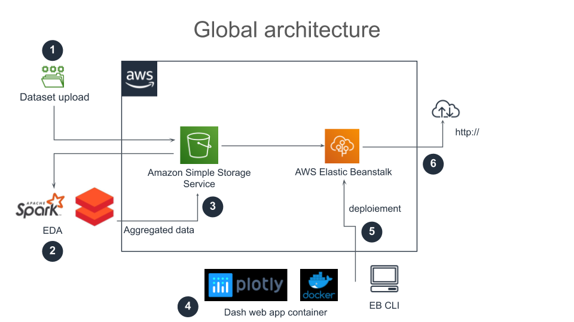
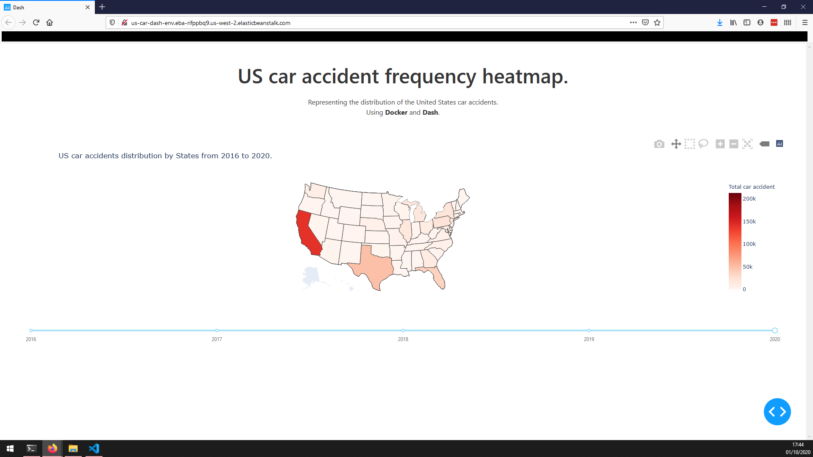

# US Car accident heatmap

## Data pipeline project

> Jedha Data Science Bootcamp 

> #dsen-paris-04 - 

## Introduction

In this project, my goal is to produce a comprehensive visualization of the distribution of the US car accidents.
Using a dataset from [kaggle](https://www.kaggle.com/sobhanmoosavi/us-accident), I manage to produce a heatmap:

## Project architecture

1. Data upload on a S3 bucket
2. Exploratory data analysis using Spark on Databricks
3. Send the aggregated data back on a S3 bucket
4. Create a Dash web app image to plot an interactive map
5. Deploy the image using Elastic Beanstalk CLI
6. Access the app on the web

