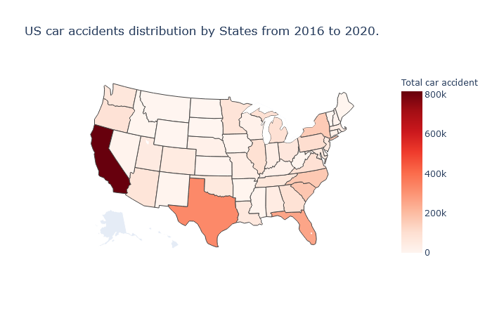
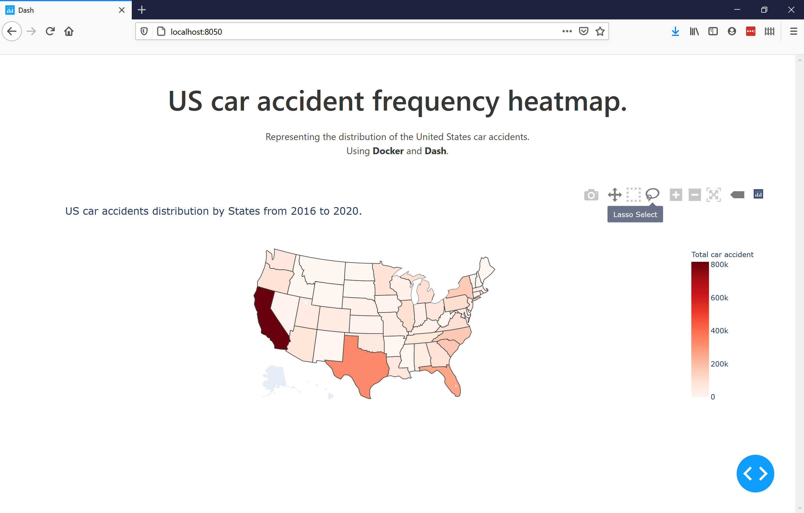

# US Car accident heatmap

Jedha Data Science Bootcamp - #dsen-paris-04 - Data pipeline project

## Introduction

In this project, my goal is produce a comprehensive visualization of the distribution of the US car accidents.
Using a dataset from [kaggle](https://www.kaggle.com/sobhanmoosavi/us-accident), I manage to produce a heatmap:

The image above is a snapshot from the `dash` component in a `container` of a python webapp:

